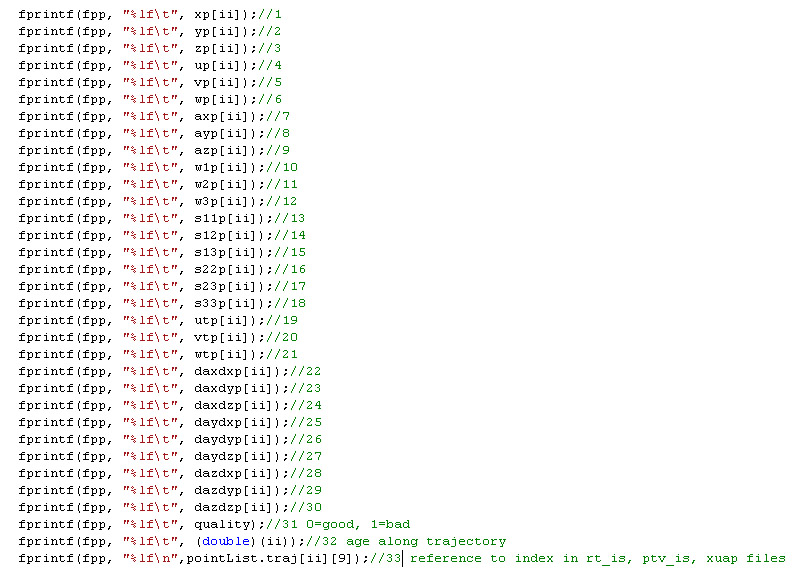
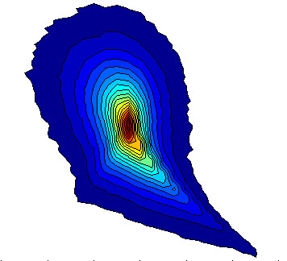
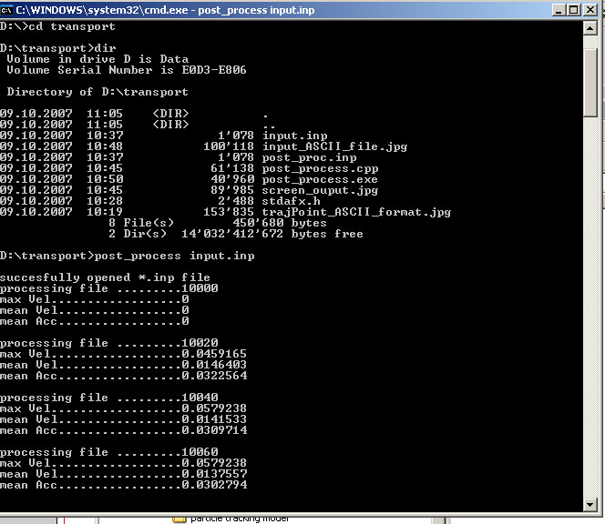
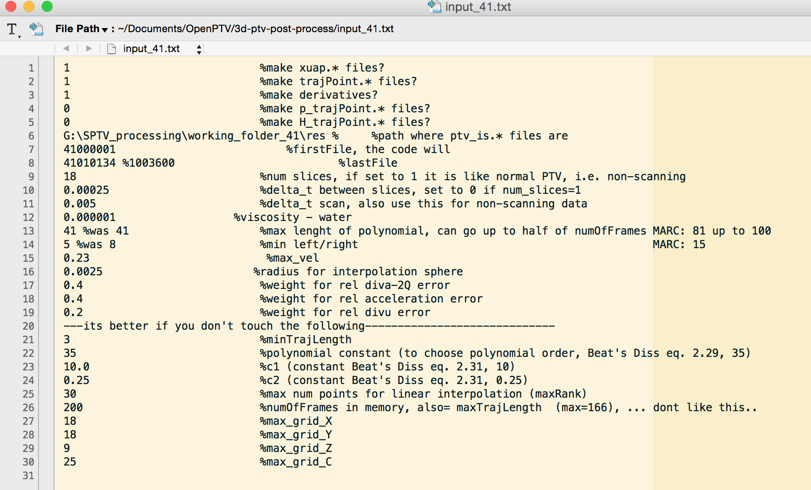

# 3D-PTV post processing C++ code   

Date: October 2007
Last modified: April 2015

The principle of the following software is described in pages 6-9 of [Luthi et al., JFM (2005)](http://journals.cambridge.org/action/displayAbstract?fromPage=online&aid=291420&fileId=S0022112004003283), and the core for the derivatives is described on page 3 of [Luthi et al., JoT (2007)](http://www.tandfonline.com/doi/abs/10.1080/14685240701522927) .


Download here: 

http://github.com/3dptv/3d-ptv-post-process


This is a command line version, written in C++. It uses a sinlge ASCII input file ( input.inp) and as output has ASCII files with filtered properties. For the full list of columns in the output see the snapshot:



It can be used to create the necessary turbulent properties to plot, for instance, the so-called *RQ* plots from `ptv_is.####` files:




## How to use it

Compile post_process.cpp on your platform using stdafx.cpp

    g++ -o post_process post_process.cpp stdafx.cpp

Type

    post_process input.inp 

The output looks like:



## What is in the configuration `input.inp` file



When producing xuap.* files along trajectories moving cubic polynomials of 3d order are fitted to the raw particle positions. From this filtered positions, velocities, and accelerations are produced and written into xuap.* files. 21 is the possible maximum of points that can be used for such a fit. The minimum is 4. It will crash with less than 4 and more than 21.
Min left/right determines how much centered such a fit should be.
Max vel is hardly used, but acts as a safety measure. Typically it should be 3-5 times larger than r.m.s u.
Radius of interpolation is a very important parameter. It determines how large the interpolation domain around a point x should be. As a rule of thumb the radius should not exceed 5 Kolmogorov units. Anything from from 7-12 points per interpolation sphere is enough.
Depending on the weights the result aims to improve quality of relative error of diva=-4Q and relative acceleration error of Du/Dt=du/dt+u du/dx.
When running the trajPoint part you should see something like the following (make sure that points per sphere are around 7-10, that the number of good points are around 40% or better, and that the values for r.m.s. u and dissipation are plausible).

## How the output looks like? 

The output is in two kinds of files. For each `ptv_is.###` there will be a `xuap.###` containing column by column the following (r=raw, f=filtered):
link_past, link_future, ```x_r,y_r,z_r,x_f,y_f,z_f,u_f,v_f,w_f,ax_f,ay_f,az_f,sucessfull```


The main result is stored in the `trajPoint.###` files. Each trajectory that starts at frame `###` will be stored in `trajPoint.###`. This explains why the second `trajPoint.###` is so much larger than all the others. The format is best explained with a screen shot of where the output is written to file:


## How to proceed with the `xuap.###` and `trajPoint.###` files

See Matlab or Python post-post-processing and graphics tools on Github, for instance from Alex:

http://github.com/alexlib/alexlib_openptv_post_processing/

